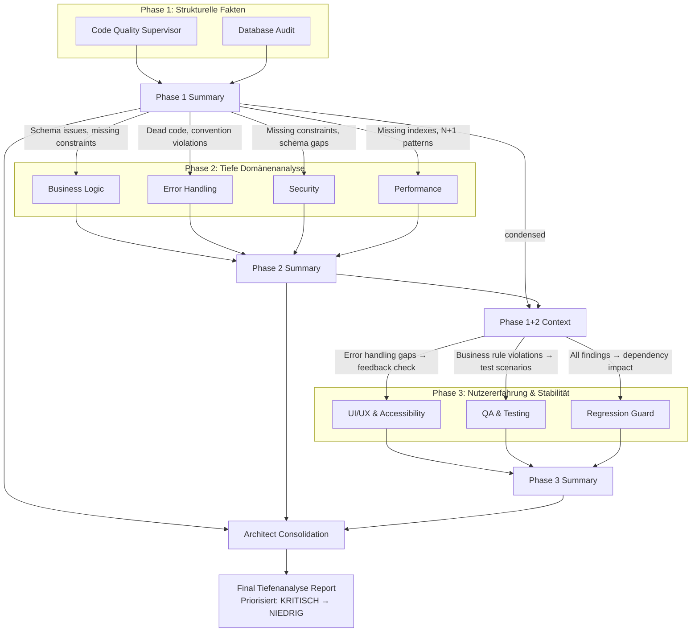

# Gestaffelte Tiefenanalyse (Staged Deep Analysis)

This skill codifies a **3-phase audit methodology** that replaces flat parallel audits with structured, context-passing phases. Each phase builds on the findings of the previous phase, producing deeper and more connected insights than running all 9 audit agents simultaneously.

## Why Phased Instead of Parallel?

Running all 9 audit agents in parallel produces:
- Duplicated findings across agents
- Missed cross-domain connections (e.g., a missing DB index causing a performance problem that manifests as a UX timeout)
- No prioritization — 200 findings with no structure

The phased approach produces:
- Each phase adds context for the next
- Cross-domain connections are explicitly traced
- Findings are deduplicated and prioritized by the time the Architect consolidates

---

## Kontextfluss-Diagramm (Context-Flow Diagram)



```
ASCII Summary:

Phase 1 (Structural Facts)          Phase 2 (Deep Domain)              Phase 3 (UX & Stability)
┌─────────────┐ ┌──────────┐       ┌──────────────┐ ┌──────────────┐  ┌───────┐ ┌────┐ ┌────────────┐
│ Code Quality │ │ Database │       │Business Logic│ │Error Handling│  │ UI/UX │ │ QA │ │ Regression │
└──────┬───────┘ └────┬─────┘       └──────┬───────┘ └──────┬───────┘  └───┬───┘ └──┬─┘ │   Guard    │
       │              │                    │                │              │        │    └─────┬──────┘
       └──────┬───────┘              ┌─────┘    ┌──────────┘              └───┬────┘         │
              │                      │          │                             │              │
              ▼                      │    ┌─────┘  ┌──────────┐              └──────┬────────┘
       ┌─────────────┐               │    │        │ Security │                     │
       │Phase 1      │──────────────►│    │        └────┬─────┘              ┌──────────────┐
       │Summary      │               │    │             │                    │Phase 3       │
       └──────┬──────┘               │    │   ┌────────┘                    │Summary       │
              │                      │    │   │   ┌─────────────┐           └──────┬───────┘
              │                      ▼    ▼   ▼   │ Performance │                  │
              │                    ┌────────────┐  └─────┬──────┘                  │
              │                    │Phase 2     │◄───────┘                         │
              │                    │Summary     │                                  │
              │                    └─────┬──────┘                                  │
              │                          │                                         │
              │                          │ ┌───────────────────────────────────────┘
              │                          │ │
              ▼                          ▼ ▼
           ┌──────────────────────────────────┐
           │   Architect Consolidation        │
           │   → Deduplicate                  │
           │   → Prioritize (KRITISCH→NIEDRIG)│
           │   → Final Report                 │
           └──────────────────────────────────┘
```

---

## The 3 Phases

### Phase 1: Strukturelle Fakten (Structural Facts)

**Agents**: Code Quality Supervisor + Database Audit

**Goal**: Establish the structural ground truth — what does the code look like, what does the schema look like, what conventions exist, what's broken at the foundation level.

**What Phase 1 Produces** (context for Phase 2):
| Finding Type | Consumed By (Phase 2) |
|---|---|
| Missing/incorrect DB indexes | → Performance Agent |
| Schema inconsistencies, missing constraints | → Business Logic Agent, Security Agent |
| Dead code, unused imports, duplicate logic | → Error Handling Agent (dead error paths) |
| Convention violations, naming issues | → All Phase 2 agents (context) |
| Query patterns (N+1, missing joins) | → Performance Agent |
| Missing foreign keys or cascades | → Business Logic Agent, Security Agent |
| Tech debt registry entries | → All Phase 2 agents (known issues) |

**Execution**:
1. Run Code Quality Supervisor (all categories)
2. Run Database Audit (all categories)
3. Compile Phase 1 Summary (see output template below)
4. Pass Phase 1 Summary as context to Phase 2 agents

**Phase 1 Output Template**:
```markdown
## Phase 1 Summary — Strukturelle Fakten

### Code Quality Findings
- Convention violations: [count] ([list top 5])
- Dead code / unused imports: [count] ([list files])
- Duplicate logic: [count] ([describe patterns])
- Tech debt items: [count]

### Database Findings
- Schema issues: [list]
- Missing indexes: [list tables + columns]
- Query anti-patterns: [list (N+1, missing joins, etc.)]
- Missing constraints/FKs: [list]
- Data integrity risks: [list]

### Cross-Cutting Observations
- [Any patterns that span both code and DB]
- [Known tech debt that affects multiple domains]

### Risk Areas for Phase 2
- [Specific files/modules that need extra scrutiny]
- [DB tables with integrity concerns → Business Logic must verify]
- [Missing indexes → Performance must measure impact]
```

---

### Phase 2: Tiefe Domänenanalyse (Deep Domain Analysis)

**Agents**: Business Logic + Error Handling + Security + Performance

**Input**: Phase 1 Summary (must be passed as context to each agent)

**Goal**: Deep analysis of business rules, error handling quality, security posture, and performance — informed by the structural facts from Phase 1.

**How Phase 1 Context Is Used**:
| Phase 2 Agent | Uses from Phase 1 |
|---|---|
| **Business Logic** | Schema inconsistencies → verify domain rules match schema; missing constraints → check if business layer compensates; duplicate logic → identify conflicting business rules |
| **Error Handling** | Dead code → check for dead error paths; convention violations → check error message consistency; query patterns → verify error handling for slow queries |
| **Security** | Missing constraints → check for authorization bypass via DB; schema issues → verify data validation; dead code → check for abandoned auth paths |
| **Performance** | Missing indexes → measure query impact; N+1 patterns → verify caching strategy; query anti-patterns → benchmark critical paths |

**What Phase 2 Produces** (context for Phase 3):
| Finding Type | Consumed By (Phase 3) |
|---|---|
| Business rule violations, workflow bugs | → QA Agent (test scenarios), Regression Guard (critical path verification) |
| Error handling gaps, missing toasts | → UI/UX Agent (user feedback verification) |
| Security vulnerabilities | → QA Agent (security test scenarios), Regression Guard (permission regression) |
| Performance bottlenecks | → UI/UX Agent (loading state verification), QA Agent (timeout testing) |
| Budget calculation issues | → QA Agent (boundary value testing) |

**Execution**:
1. Pass Phase 1 Summary to each Phase 2 agent
2. Run Business Logic Audit (with Phase 1 context)
3. Run Error Handling Audit (with Phase 1 context)
4. Run Security Audit (with Phase 1 context)
5. Run Performance Audit (with Phase 1 context)
6. Compile Phase 2 Summary
7. Pass Phase 1 + Phase 2 Summary as context to Phase 3 agents

**Phase 2 Output Template**:
```markdown
## Phase 2 Summary — Tiefe Domänenanalyse

### Business Logic Findings
- Domain rule violations: [count] ([list with severity])
- Workflow integrity issues: [list]
- Cross-confirmed with Phase 1: [which DB issues affect business rules]

### Error Handling Findings
- Missing error handlers: [count] ([list routes/mutations])
- Non-German error messages: [count]
- Dead error paths (from Phase 1 dead code): [list]

### Security Findings
- Vulnerabilities: [count by severity]
- Auth/permission gaps: [list]
- Input validation gaps: [list]
- Phase 1 cross-reference: [which schema issues create security risks]

### Performance Findings
- Bottlenecks: [list with measured/estimated impact]
- Phase 1 cross-reference: [which missing indexes cause measurable slowdowns]
- Caching gaps: [list]

### Risk Areas for Phase 3
- [Business rules that need QA test scenarios]
- [Error handling gaps that affect UX]
- [Security issues that need regression guarding]
- [Performance issues that affect mobile UX]
```

---

### Phase 3: Nutzererfahrung & Stabilität (User Experience & Stability)

**Agents**: UI/UX & Accessibility + QA & Testing + Regression Guard

**Input**: Phase 1 Summary + Phase 2 Summary (must be passed as context to each agent)

**Goal**: Validate that the user experience is correct and that changes haven't broken existing functionality — with full knowledge of what Phase 1 and Phase 2 found.

**How Phase 1+2 Context Is Used**:
| Phase 3 Agent | Uses from Phase 1+2 |
|---|---|
| **UI/UX** | Error handling gaps → verify user feedback exists; performance bottlenecks → verify loading states; business rule violations → verify UI reflects correct rules; dead code → check for orphaned UI components |
| **QA** | Business rule violations → generate targeted test scenarios; security vulnerabilities → generate security test cases; performance bottlenecks → test timeout edge cases; error handling gaps → test error recovery flows |
| **Regression Guard** | All Phase 1+2 findings → map changed files to dependency tree; security permission changes → verify permission matrix; business rule changes → verify critical path integrity; schema changes → verify migration safety |

**Execution**:
1. Pass Phase 1 + Phase 2 Summaries to each Phase 3 agent
2. Run UI/UX & Accessibility Audit (with full context)
3. Run QA & Testing Audit (with full context)
4. Run Regression Guard (with full context)
5. Compile Phase 3 Summary

**Phase 3 Output Template**:
```markdown
## Phase 3 Summary — Nutzererfahrung & Stabilität

### UI/UX Findings
- Accessibility issues: [count] ([list])
- Mobile usability issues: [count]
- Missing loading/feedback states: [count]
- German wording issues: [count]
- Phase 2 cross-reference: [which error handling gaps manifest as UX issues]

### QA Findings
- Test scenarios generated from Phase 2: [count]
- Happy path issues: [count]
- Edge case issues: [count]
- Phase 2 cross-reference: [test cases targeting business rule violations]

### Regression Guard Findings
- Dependency impact scope: [count files affected]
- Critical paths verified: [X/5]
- API contract changes: [list]
- Permission changes: [list]
- Phase 1+2 cross-reference: [regressions caused by structural or domain issues]
```

---

## Phase 4: Architect Consolidation

**Agent**: Architect (built-in code_review tool)

**Input**: Phase 1 + Phase 2 + Phase 3 Summaries

**Goal**: Consolidate all findings into a single, prioritized action plan. Deduplicate findings that were reported by multiple agents. Assign severity and effort estimates.

**Execution**:
1. Call `architect()` with all phase summaries as the task context
2. Architect produces the Final Tiefenanalyse Report

**Final Report Template**:
```markdown
# Tiefenanalyse Report — [Scope Name]

## Executive Summary
- Total findings: [count]
- KRITISCH (must fix): [count]
- HOCH (should fix soon): [count]  
- MITTEL (should fix): [count]
- NIEDRIG (nice to have): [count]

## Priorisierte Maßnahmen (Prioritized Actions)

### KRITISCH — Sofort beheben
| # | Finding | Source Phase | Affected Modules | Effort |
|---|---------|-------------|------------------|--------|
| 1 | [description] | Phase [X] — [Agent] | [modules] | [S/M/L] |

### HOCH — Zeitnah beheben
| # | Finding | Source Phase | Affected Modules | Effort |
|---|---------|-------------|------------------|--------|

### MITTEL — Einplanen
| # | Finding | Source Phase | Affected Modules | Effort |
|---|---------|-------------|------------------|--------|

### NIEDRIG — Bei Gelegenheit
| # | Finding | Source Phase | Affected Modules | Effort |
|---|---------|-------------|------------------|--------|

## Deduplizierte Querbezüge (Cross-References)
[Findings that appeared in multiple phases/agents — listed once with all sources]

## Empfohlene Reihenfolge (Recommended Fix Order)
1. [First fix — unblocks other fixes]
2. [Second fix — depends on #1]
3. ...
```

---

## Audit Variants

### Variante 1: Feature-Audit

**Scope**: Single feature or user story (e.g., "Termin dokumentieren")

**When**: After implementing a feature, before marking the task complete.

**Customization**:
- Phase 1: Focus Code Quality + Database checks on feature files only
- Phase 2: Focus Business Logic on the feature's domain rules; Error Handling on feature's mutations; Security on feature's endpoints; Performance on feature's queries
- Phase 3: Focus QA on feature's test scenarios; UI/UX on feature's pages; Regression Guard on feature's dependency tree
- Architect: Focused report, typically 10–30 findings

**Typical Duration**: 1 session (15–30 min agent time)

### Variante 2: Modul-Audit

**Scope**: Entire module or domain cluster (e.g., "Budget & Abrechnung" covering budget-ledger, billing, pricing, invoices)

**When**: Before deploying a module with significant changes, or during periodic reviews.

**Customization**:
- Phase 1: All Code Quality + Database checks scoped to module files
- Phase 2: Full depth on all 4 agents, scoped to module
- Phase 3: Full depth on all 3 agents, scoped to module + dependencies
- Architect: Module-level report, typically 30–80 findings

**Typical Duration**: 1–2 sessions (30–60 min agent time)

### Variante 3: Full-App-Audit (Voll-Audit)

**Scope**: Entire application, organized in domain clusters.

**When**: Before major releases, quarterly reviews, or after onboarding a new codebase.

**Customization**:
- Divide the app into domain clusters (see cluster template below)
- Run the 3-phase audit on each cluster sequentially
- Architect consolidates findings across all clusters

**Cluster Template for Full-App-Audit**:
```markdown
| # | Cluster | Priority | Key Files | Dependencies |
|---|---------|----------|-----------|--------------|
| 1 | [Name] | HOCH/MITTEL/NIEDRIG | [file patterns] | Depends on: [other clusters] |
| 2 | [Name] | ... | ... | ... |
```

**Ordering Rule**: HOCH-priority clusters first, respecting inter-cluster dependencies. A cluster that depends on another cluster's findings must run after it.

**Typical Duration**: 3–6 sessions depending on app size

---

## Context-Passing Protocol

### How to Pass Context Between Phases

When invoking each agent (via the architect/delegation skill), include the accumulated phase summaries in the task description:

```
Task: Run [Agent Name] audit on [scope]

## Context from Previous Phases

[Paste Phase 1 Summary here]

[Paste Phase 2 Summary here, if running Phase 3]

## Focus Areas Based on Prior Findings
- [Specific items from prior phases that this agent should investigate]
```

### Context Size Management

For large audits, the phase summaries may become lengthy. Use these rules:
1. **Phase 1 → Phase 2**: Pass full Phase 1 summary (typically < 2000 words)
2. **Phase 1+2 → Phase 3**: Pass Phase 1 summary (condensed to key findings) + full Phase 2 summary
3. **All → Architect**: Pass condensed summaries from all 3 phases (focus on findings, not methodology)

### Condensing Rules

When condensing a phase summary for downstream consumption:
- Keep all KRITISCH and HOCH findings verbatim
- Summarize MITTEL findings as counts with top 3 examples
- Drop NIEDRIG findings (only mention count)
- Always keep cross-reference sections (they're the most valuable part)

---

## Integration with Existing Skills

This skill **orchestrates** the existing 9 audit skills. It does NOT replace them. Each audit agent still follows its own SKILL.md for the actual checks.

| Existing Skill | Role in Deep Analysis |
|---|---|
| `code-quality-supervisor` | Phase 1 agent |
| `database-audit` | Phase 1 agent |
| `business-logic-audit` | Phase 2 agent |
| `error-handling-audit` | Phase 2 agent |
| `security-audit` | Phase 2 agent |
| `performance-audit` | Phase 2 agent |
| `ui-ux-audit` | Phase 3 agent |
| `qa-testing` | Phase 3 agent |
| `regression-guard` | Phase 3 agent |
| `team-orchestration` | Complementary: team-orchestration defines WANN (when/which agents to run per task); deep-analysis defines WIE (how to structure a deep audit with context-passing phases). Use team-orchestration for per-task agent selection, deep-analysis for thorough multi-agent audits |
| `devops-release` | Run separately before deployment, not part of the 3-phase flow |

---

## Quick-Start Checklist

For any Tiefenanalyse, follow this checklist:

1. [ ] **Define scope**: Feature, Module, or Full-App?
2. [ ] **Identify files**: Which files/modules are in scope?
3. [ ] **Assign priority**: HOCH / MITTEL / NIEDRIG for the scope
4. [ ] **Phase 1**: Run Code Quality + Database → compile summary
5. [ ] **Phase 2**: Pass Phase 1 context → run Business Logic + Error Handling + Security + Performance → compile summary
6. [ ] **Phase 3**: Pass Phase 1+2 context → run UI/UX + QA + Regression Guard → compile summary
7. [ ] **Architect**: Pass all summaries → produce final prioritized report
8. [ ] **Action Items**: Create tasks for KRITISCH and HOCH findings

---

## Anti-Patterns (What NOT to Do)

| Anti-Pattern | Why It's Bad | Instead Do |
|---|---|---|
| Run all 9 agents in parallel | No context flow, duplicated findings, no prioritization | Use 3-phase structure |
| Skip Phase 1 and go straight to Business Logic | Business Logic agent lacks structural context, misses DB-driven bugs | Always start with Phase 1 |
| Skip Phase 3 for "backend-only" changes | Backend changes always affect UX and regression surface | Always run Phase 3 (scope it down if needed) |
| Pass raw agent output as context (not summarized) | Context window overflow, important findings buried in noise | Use the summary templates |
| Run Architect without phase summaries | Architect lacks context for prioritization and deduplication | Always pass all phase summaries |
| Audit NIEDRIG modules before HOCH modules | Wastes time on low-risk areas while critical bugs remain | Follow priority ordering |
