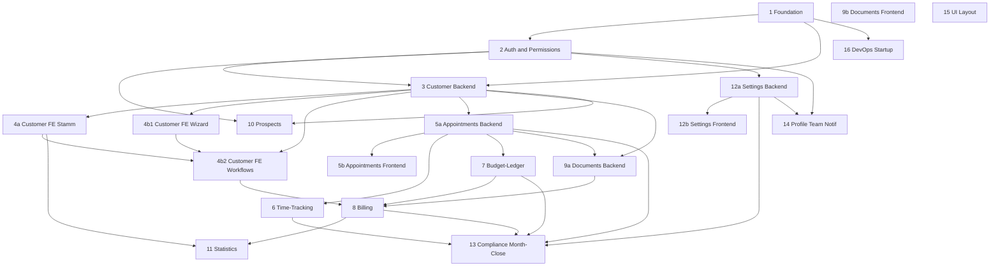

# Full-App-Audit 2026 — Chunk-Plan

**Datum:** 2026-05-15
**Task:** #480 — Full-App-Audit in kontextsichere Chunks zerschneiden
**Status:** Plan-Dokument (keine Findings, keine Bewertungen)
**Nachgelagerter Task:** „Full-App-Check Drehbuch und Durchführung"

---

## 0. Executive Summary

Die CareConnect-Codebase umfasst aktuell **521 produktive `.ts`/`.tsx`-Dateien
mit 116 282 LOC** (ohne Tests, `node_modules`, `dist`, `coverage`). Ein
einzelner Audit-Lauf über alles würde sowohl das Architect-Kontextfenster
sprengen als auch jede Priorisierung verhindern.

Dieser Plan schneidet die gesamte produktive Codebase **vollständig und
überlappungsfrei** in **21 Audit-Chunks** (15 Haupt-Chunks plus 6 Pflicht-
Sub-Chunks für die größten Domains) auf. **Jede Datei aus dem Inventory ist
genau einem Chunk oder dem Out-of-Scope-Bucket zugeordnet** — die maschinen-
lesbare Zuordnung steht in `chunk-manifest.json`. Pro Chunk sind LOC-Bilanz,
Risiko, beteiligte Audit-Skills, Abhängigkeiten, Kontext-Budget und harte
Stop-Kriterien definiert.

**Bilanz:** 512 Dateien / **113 947 LOC** in Audit-Chunks + 9 Dateien /
**2 335 LOC** explizit Out-of-Scope (Dev/Test-Routen + manuell ausgeführte
Cleanup-Skripte; §7) = **521 / 116 282** (Inventory-Total).

Die Ausführungsreihenfolge ergibt sich aus dem **DAG in §5** und folgt dem
Prinzip „Foundation zuerst, Compliance zuletzt". Das größte Chunk (5b
Appointments FE) liegt bei 7 918 LOC und unterschreitet damit den harten
Cap von 8 000 LOC.

Quellen-Inventar: `docs/audits/full-app-2026/inventory.json` (automatisch
erzeugt). Audit-Manifest: `docs/audits/full-app-2026/chunk-manifest.json`
(File→Chunk-Mapping mit voller Pfadliste pro Chunk).

---

## 1. Methodische Grundlagen

### 1.1 Audit-Methodik (verbindlich)

Pro Chunk wird die **Variante 2 (Modul-Audit) aus
`.agents/skills/deep-analysis/SKILL.md`** angewandt — drei kontext-tragende
Phasen plus Konsolidierung:

- **Phase 1 — Strukturelle Fakten:** Code Quality + Database.
- **Phase 2 — Tiefe Domänenanalyse:** Business Logic + Error Handling +
  Security + Performance (mit Phase-1-Kontext).
- **Phase 3 — UX & Stabilität:** UI/UX + QA + Regression Guard (mit Phase
  1+2-Kontext).
- **Phase 4 — Architect-Consolidation:** Dedupliziert und priorisiert auf
  KRITISCH/HOCH/MITTEL/NIEDRIG.

Risiko-Klassifizierung folgt der HOCH/MITTEL/NIEDRIG-Matrix aus
`.agents/skills/team-orchestration/SKILL.md`. Abweichungen sind pro Chunk
explizit begründet (§3 — Spalte „Risiko-Begründung").

### 1.2 Kontext-Budget pro Audit-Run

Faustformel aus interner Audit-Erfahrung der letzten Wellen plus den
allgemeinen Long-Context-Hinweisen von Anthropic (Quelle [1]):

| Größe pro Chunk | Realistisches Budget | Vorgehen |
|---|---|---|
| ≤ 4 000 LOC | Komfortabel — alle Phasen in einem Run | Standard |
| 4 000 – 6 000 LOC | Möglich, Architect-Summary muss verdichtet werden | Phase-Summary-Template strikt einhalten |
| 6 000 – 8 000 LOC | Grenzbereich. Phase 1 & 2 separat halten. | Pro Phase eigener Subagent-Run |
| > 8 000 LOC | **Pflicht-Split** (siehe §3) | Verboten als Single-Run |

Der harte Cap orientiert sich an der internen Erfahrung, dass ein Architect-
Run mit > 8 000 LOC Eingabe + 9 Audit-Reports regelmäßig in Compaction
läuft und Findings verliert. Wir splitten entlang natürlicher Schichten
(Backend/Frontend, Stammdaten/Workflows) statt willkürlich nach LOC.

### 1.3 Stop-Kriterien pro Chunk

Ein Chunk-Audit gilt als **fertig**, wenn:

1. Phase 1 + 2 + 3 abgeschlossen sind und alle drei Phase-Summaries
   geschrieben wurden.
2. Architect-Consolidation gelaufen ist (Final Report `KRITISCH→NIEDRIG`).
3. Alle **KRITISCH-Findings** entweder
   - direkt im selben Folge-Task gefixt sind, **oder**
   - als eigene Project-Tasks im Backlog mit `priority: HIGH` angelegt sind.
4. Cross-References zu nicht-fertigen Chunks **explizit notiert** sind
   (z.B. „Customer-Audit hat Auth-Annahme X — verifizieren in Chunk 2").
5. Das jeweils **Chunk-spezifische** Stop-Kriterium aus §3 ist erfüllt.

---

## 2. Modul-Karte (Mermaid)



Chunks **15 (UI-Komponenten)** und **16 (DevOps)** sind weitgehend
unabhängig vom Domänen-Kern und können **parallel** zu jedem Zeitpunkt
gefahren werden.

---

## 3. Chunk-Definitionen

LOC- und Datei-Zahlen sind die **programmatisch berechneten Werte aus
`chunk-manifest.json`** (Stand 2026-05-15). Vollständige Datei-Listen pro
Chunk: dort.

| # | Name | Files | LOC | Risiko | Risiko-Begründung |
|---|---|---:|---:|---|---|
| 1   | Foundation: Shared Schema/API/Domain                 | 62 | 7 730 | HOCH    | Schema-Drift bricht alle Domains; verschlüsselte Spalten cross-cutting |
| 2   | Auth & Permissions                                   | 13 | 3 548 | HOCH    | Threat-Model-Kern (Spoofing + Elevation) |
| 3   | Customer-Domain Backend                              | 22 | 6 208 | HOCH    | IDOR-Risiko, DSGVO-Anonymisierung, Sonderpreise |
| 4a  | Customer Stammdaten & Listen (FE)                    |  5 | 2 979 | HOCH    | E2E-Smoke-Persistence-Hotspot |
| 4b1 | Customer FE: Anlage-Wizard + Verträge/Versicherung   | 15 | 4 835 | HOCH    | Vertrags-Daten + Signatur in Multi-Step-Wizard |
| 4b2 | Customer FE: Detail-Workflows (Pricing/Docs/Kontakte)| 30 | 7 543 | HOCH    | Custom-Pricing, Audit-Log-Trigger, Privatabrechnung |
| 5a  | Appointments Backend                                 | 11 | 5 359 | HOCH    | Server-seitige Validierung, ArbZG, Doppelbuchung |
| 5b  | Appointments Frontend                                | 34 | 7 918 | HOCH    | Dokumentations-Wizard, Mobile-Tap-Targets |
| 6   | Time-Tracking & Vacation                             | 27 | 5 566 | HOCH    | Pro-Rata-Urlaub, Auto-Pausen, Reisekosten |
| 7   | Budget-Ledger                                        | 18 | 6 260 | HOCH    | Three-Pot, §45b-Cap, Historisierung, Concurrency |
| 8   | Billing & Invoicing                                  | 13 | 7 194 | HOCH    | GoBD, ZUGFeRD, Qonto-Webhook, Custom-Pricing |
| 9a  | Documents Backend                                    | 18 | 5 207 | HOCH    | Public-Signing-Token, PDF-Integrity, Object-Storage |
| 9b  | Documents Frontend                                   |  8 | 3 327 | HOCH    | SignaturePad-SSoT, Template-Editor |
| 10  | Lead/Prospect Pipeline                               | 17 | 3 251 | MITTEL  | Webhooks + E-Mail-Parsing, geringere Datenmenge |
| 11  | Statistics & Cockpit                                 | 25 | 6 922 | **MITTEL** | Read-only Aggregations; **hochgesetzt von NIEDRIG**, weil Cockpit Finanz-/Mitarbeiter-KPIs aus Chunks 7+8 spiegelt — Korrektheit business-kritisch |
| 12a | Settings Backend & External Integrations             | 19 | 3 763 | **MITTEL** | Settings i.d.R. NIEDRIG; **hochgesetzt**, weil Twilio/Qonto/Email-Secrets + AES-256-GCM-Encryption hier verwaltet werden |
| 12b | Settings Frontend                                    | 11 | 5 016 | MITTEL  | UI-only, aber Mitarbeiter-CRUD + Service-Pricing |
| 13  | Compliance: Month-Close + Audit-Trail                |  8 | 2 765 | HOCH    | GoBD-Append-Only, Cutoff, Superadmin-Reopen |
| 14  | Profile, Team, Notifications, Tasks                  | 45 | 7 523 | MITTEL  | Mitarbeiter-Selbstbedienung, weniger Schutzgüter |
| 15  | Mobile/Layout/Design-System                          | 57 | 6 971 | NIEDRIG | Reines UI-Layer, keine Domain-Logik |
| 16  | DevOps & Startup-Migrationen                         | 54 | 4 062 | MITTEL  | Migrations-Idempotenz + Deployment-Pfade |
| **Σ** | (alle In-Scope-Chunks)                           | **512** | **113 947** |  |  |
|     | Out-of-Scope (Dev/Test-only, §7)                     |  9 | 2 335 | – | – |
| **Σ** | **Inventory total**                                  | **521** | **116 282** |  |  |

### Pro-Chunk-Detail-Block

Jeder Chunk hat denselben festen Detail-Block. Datei-Listen sind in
`chunk-manifest.json` (`chunks.<id>.paths`).

#### Chunk 1 — Foundation: Shared Schema/API/Domain — **HOCH**

- **Inhalt:** `shared/**` (52 Files) + cross-cutting Client-Lib
  (`query-invalidation`, `queryClient`, `utils`, `api-types`,
  `query-keys`) + cross-cutting Server-Lib (`server/lib/errors`,
  `idempotency`, `encrypted-*`, `logger`).
- **62 Files, 7 730 LOC** (Grenzbereich; Phase 1+2 separate Runs).
- **Skills:** Code Quality, Database, API Contract, Security
  (encrypted-columns).
- **Abhängigkeiten:** keine — **läuft als erstes**.
- **Stop-Kriterium:** Alle DB-Tabellen, Zod-Schemas und API-Contracts sind
  in Anhang A des Audit-Reports als Domain-Map dokumentiert; alle nicht-
  encrypted Spalten mit Namensmuster `secret|token|password|key` haben
  Allowlist-Einträge.

#### Chunk 2 — Auth & Permissions — **HOCH**

- **Inhalt:** `server/routes/auth.ts`, `server/services/auth.ts`,
  `server/middleware/{auth,csrf,rate-limit,object-storage-auth}`,
  `server/lib/params.ts`, `server/routes/admin/employee-users.ts`,
  Login-/Reset-/Setup-Pages, `client/src/components/session-timeout-*`.
- **13 Files, 3 548 LOC.**
- **Skills:** Security (Cat 1–6), Regression Guard
  (Permission-Regression), Error Handling, Code Quality.
- **Abhängigkeiten:** Chunk 1.
- **Stop-Kriterium:** Threat-Model-Sektionen „Spoofing" + „Elevation of
  Privilege" punktweise durchgeprüft; jede Admin/Superadmin-Route hat
  verifizierten Hierarchie-Check; alle Reset-/Invite-Tokens haben
  Ablauf + Einmal-Verbrauch.

#### Chunk 3 — Customer-Domain Backend — **HOCH**

- **Inhalt:** alle `server/routes/customers*`, `server/routes/admin/
  customers*`, `server/storage/customer*`, `server/lib/customer-creation-
  helpers`, `server/services/customer-deletion-service`, plus
  `client/src/pages/admin/{customer-new,contact-migration}.tsx` (dünne
  Frontend-Hülle der gleichen Workflows).
- **22 Files, 6 208 LOC.**
- **Skills:** Security (IDOR), Business Logic, Database, API Contract,
  Error Handling.
- **Abhängigkeiten:** Chunk 1, Chunk 2.
- **Stop-Kriterium:** Jede customerId/contactId/priceId-führende Route
  hat verifizierten Ownership-Check; DSGVO-Anonymisierungs-Pfad ist
  reversierbar dokumentiert; Sonderpreis-Mutations schreiben Audit-Log.

#### Chunk 4a — Customer Stammdaten & Listen (FE) — **HOCH**

- **Inhalt:** `client/src/pages/customers.tsx`,
  `client/src/pages/customer-detail.tsx`,
  `client/src/pages/admin/customers.tsx`,
  `client/src/pages/admin/customer-detail.tsx`,
  `client/src/pages/admin/duplicates.tsx`.
- **5 Files, 2 979 LOC.**
- **Skills:** UI/UX, Performance, QA, Code Quality.
- **Abhängigkeiten:** Chunk 1, Chunk 3.
- **Stop-Kriterium:** E2E-Smoke Round-Trip Kunden-Edit
  (`e2e/smoke/edit-persistence.spec.ts` Test 1) grün; Duplikat-Such-
  Performance < 500 ms bei 5 000 Kunden.

#### Chunk 4b1 — Customer FE: Anlage-Wizard + Verträge/Versicherung — **HOCH**

- **Inhalt:** `client/src/features/customers/components/wizard/**`,
  `client/src/features/customers/hooks/use-customer-wizard.ts`,
  `client/src/features/customers/components/admin/customer-contract-*`,
  `client/src/features/customers/components/admin/customer-insurance-*`.
- **15 Files, 4 835 LOC.**
- **Skills:** UI/UX, QA, Business Logic, Code Quality, Regression Guard.
- **Abhängigkeiten:** Chunk 1, Chunk 3, Chunk 4a.
- **Stop-Kriterium:** Wizard-Schritte sind step-by-step durchlaufbar mit
  Validierung; SignaturePad-SSoT eingehalten (`replit.md` User
  Preference); Kontaktdaten-Round-Trip grün.

#### Chunk 4b2 — Customer FE: Detail-Workflows (Pricing/Docs/Kontakte) — **HOCH**

- **Inhalt:** `client/src/features/customers/components/admin/customer-
  pricing-*`, `customer-documents-*`, `customer-contacts-*`,
  `digital-document-*`, `admin-overview/**`, sowie restliche
  `client/src/features/customers/**`.
- **30 Files, 7 543 LOC.**
- **Skills:** UI/UX, Business Logic, Performance, QA, Regression Guard.
- **Abhängigkeiten:** Chunk 1, Chunk 3, Chunk 4a, **Chunk 7** (Budget-
  Settings im Customer-Detail), **Chunk 9a** (Document-Flow-Trigger).
  — **Chunk 8 ist nachgelagert** (Billing nutzt die hier gepflegten
  Sonderpreise; nicht umgekehrt).
- **Stop-Kriterium:** Custom-Pricing-Mutationen erzeugen lesbare Audit-
  Log-Einträge mit Vorher/Nachher; Digital-Document-Flow-Status-Übergänge
  konsistent zu Chunk 9b.

#### Chunk 5a — Appointments Backend — **HOCH**

- **Inhalt:** `server/routes/appointment*`, `server/services/appointment*`,
  `server/storage/appointment*`, `server/services/auto-breaks` (Cross-Ref
  Chunk 6 — laut Heuristik primär Time-Tracking; hier nur falls in 5a-Pfad),
  `server/routes/admin/import-appointments`, `server/startup/sync-
  appointment-service-durations`.
- **11 Files, 5 359 LOC.**
- **Skills:** Business Logic, Database, Performance, Security, QA, API
  Contract.
- **Abhängigkeiten:** Chunk 1, Chunk 2, Chunk 3.
- **Stop-Kriterium:** Equality-Suite (`tests/equality/*` für Pflegegrad-
  Pricing + Reisekosten) grün; Server-seitige Slot-Validierung
  vollständig (kein Bypass über Direkt-API).

#### Chunk 5b — Appointments Frontend — **HOCH**

- **Inhalt:** `client/src/features/appointments/**`,
  `client/src/pages/edit-appointment.tsx`, `appointment-detail`,
  `document-appointment`, `new-appointment`, `admin/import-appointments`,
  `admin/appointment-series`.
- **34 Files, 7 918 LOC** (knapp unter Cap — Phase 1/2/3 strikt separat
  fahren).
- **Skills:** UI/UX, Performance, Code Quality, QA, Regression Guard.
- **Abhängigkeiten:** Chunk 5a, Chunk 4a.
- **Stop-Kriterium:** E2E-Smoke Round-Trip Termin (Tests 6+7) grün;
  Mobile-Scroll/Datepicker-Bugs aus offenem Backlog adressiert oder als
  Folge-Task notiert.

#### Chunk 6 — Time-Tracking & Vacation — **HOCH**

- **Inhalt:** `server/routes/time-entries`, `month-closing`,
  `holidays`, `server/services/{auto-breaks,travel-time,
  time-entry-validation}`, `server/storage/time-tracking/**` (außer
  `month-closing.ts` → Chunk 13), `server/startup/sync-vacation-carryover`,
  `client/src/features/time-tracking/**`, `client/src/pages/{admin/
  time-entries,admin/availability,my-times,zeiten,meine-zeiten}`.
- **27 Files, 5 566 LOC.**
- **Skills:** Business Logic, Database, QA, Regression Guard, Performance.
- **Abhängigkeiten:** Chunk 2, Chunk 5a.
- **Stop-Kriterium:** Drift-Detektor `tests/equality/pro-rata-vacation.
  test.ts` grün; Mitarbeiter- vs. Admin-Totale identisch (offener Backlog
  als Cross-Ref).

#### Chunk 7 — Budget-Ledger — **HOCH**

- **Inhalt:** `server/routes/budget*`, `server/storage/budget/**`,
  `server/startup/*budget*`, `client/src/components/budget/**`.
- **18 Files, 6 260 LOC.**
- **Skills:** Business Logic, Database, Performance, QA, Regression Guard,
  Security.
- **Abhängigkeiten:** Chunk 1, Chunk 3, Chunk 5a.
- **Stop-Kriterium:** Property-Test `tests/budget/properties-display-vs-
  booking.test.ts` und `tests/equality/45b-cap.test.ts` grün;
  Migration `backfill-budget-historization.ts` idempotent verifiziert.

#### Chunk 8 — Billing & Invoicing — **HOCH**

- **Inhalt:** `server/routes/billing.ts`, `server/routes/admin/{lexware,
  qonto}`, `server/services/{qonto,avis-parser,invoice-integrity-
  verifier}`, `server/storage/qonto`, `server/lib/{pdf-generator,zugferd}`,
  `client/src/pages/admin/{billing,qonto,lexware}`, Billing-Features.
- **13 Files, 7 194 LOC** (knapp unter Cap).
- **Skills:** Business Logic, Security (Webhook-Sig Qonto), Error
  Handling, Performance, QA, Regression Guard, Code Quality, API Contract.
- **Abhängigkeiten:** Chunk 3, Chunk 4b2, Chunk 5a, Chunk 7, Chunk 9a.
- **Stop-Kriterium:** Alle Billing-Flow-Tests grün; Coverage-Gate
  `billing.ts` (Lines ≥ 55 %, Branches ≥ 45 %) gehalten; ZUGFeRD-PDF-
  Validator-Pass auf Test-Stichprobe.

#### Chunk 9a — Documents Backend — **HOCH**

- **Inhalt:** `server/routes/{service-records,public-signing,admin/
  documents,admin/document-delivery,customers/documents}`,
  `server/services/{document-pdf,document-delivery,document-trigger-
  engine,document-review,cover-letter,template-engine,letterxpress-
  service}`, `server/storage/{documents,service-records-storage}`,
  `server/replit_integrations/object_storage/**`.
- **18 Files, 5 207 LOC.**
- **Skills:** Security (Token-Lifecycle, Object-Storage-Authz, HTML/PDF-
  Injection), Business Logic, Error Handling, QA.
- **Abhängigkeiten:** Chunk 2, Chunk 3, Chunk 5a.
- **Stop-Kriterium:** Threat-Model-Anker `public-signing.ts` +
  `document-pdf.ts` durchgeprüft; PDF-Integrity-Hash bei jeder Stichprobe
  reproduzierbar; Object-Path-Authz ↔ DB-Authz match-test grün.

#### Chunk 9b — Documents Frontend — **HOCH**

- **Inhalt:** `client/src/pages/{service-records,service-record-detail,
  admin/document-types,admin/document-templates,admin/proof-review}`,
  `client/src/components/ui/signature-pad`,
  `client/src/features/documents/**`, `client/src/pages/sign*`.
- **8 Files, 3 327 LOC.**
- **Skills:** UI/UX (Touch + Signature Accessibility), Performance, QA,
  Code Quality.
- **Abhängigkeiten:** Chunk 9a, Chunk 4b2.
- **Stop-Kriterium:** SignaturePad ist einzige Unterschrift-Komponente
  (Grep auf `<canvas` außerhalb `signature-pad.tsx` = leer); Template-
  Editor-Round-Trip persistiert Placeholder korrekt; E2E-Smoke
  Leistungsnachweis grün.

#### Chunk 10 — Lead/Prospect Pipeline — **MITTEL**

- **Inhalt:** `server/routes/{prospects,admin/prospects,search,webhook-
  twilio}`, `server/services/{email-parser,lead-auto-reply,call-
  scheduler,twilio-call-bridge}`, `server/storage/prospects`,
  `client/src/features/prospects/**`, Prospect-Pages.
- **17 Files, 3 251 LOC.**
- **Skills:** Security (Webhook-Sig, Email-Parsing-Injection), Business
  Logic, Error Handling, QA.
- **Abhängigkeiten:** Chunk 2, Chunk 3.
- **Stop-Kriterium:** Threat-Model-Anker `prospects.ts` durchgeprüft;
  Such-Endpoint leakt keine ungescopten Lead-Daten (offener Backlog).

#### Chunk 11 — Statistics & Cockpit — **MITTEL**

- **Inhalt:** `server/storage/statistics/**`, `server/lib/team-workload`,
  `client/src/pages/admin/statistics/**`, `dashboard`,
  `admin/dashboard`, `team-workload`, `client/src/components/charts/**`.
- **25 Files, 6 922 LOC.**
- **Skills:** Performance (schwere Queries), Database, UI/UX (Cockpit
  Mobile), Business Logic.
- **Abhängigkeiten:** Chunk 3, Chunk 5, Chunk 6, Chunk 7, Chunk 8.
- **Stop-Kriterium:** Aggregations-Korrektheit gegen Roh-Daten Stichprobe
  bestätigt; P95 ≤ 800 ms aller Statistik-Endpoints im Smoke-Run.

#### Chunk 12a — Settings Backend & External Integrations — **MITTEL**

- **Inhalt:** `server/routes/{company,settings,services,whatsapp,admin/
  {whatsapp,insurance-providers,employee-availability},webhook}`,
  `server/services/{whatsapp-service,email-service,notification-service,
  cache,geocoding,employee-availability}`, `server/storage/{whatsapp,
  service-catalog}`, `server/startup/{seed-pkv-providers,import-
  pflegekassen}`.
- **19 Files, 3 763 LOC.**
- **Skills:** Security (AES-256-GCM Encryption-Roundtrip, Webhook-Sig,
  Secret-Storage), DevOps, Code Quality, API Contract.
- **Abhängigkeiten:** Chunk 1, Chunk 2.
- **Stop-Kriterium:** Encryption-Roundtrip-Test (verschlüsseltes Secret
  → DB → entschlüsselt = Original) grün; Twilio-WhatsApp-Webhook-Sig
  vor allen Mutations geprüft; Geocoding-Outbound hat Allow-Listen.

#### Chunk 12b — Settings Frontend — **MITTEL**

- **Inhalt:** `client/src/pages/admin/{settings,whatsapp,insurance-
  providers,users,services,company}`.
- **11 Files, 5 016 LOC.**
- **Skills:** UI/UX, Code Quality, QA, Error Handling.
- **Abhängigkeiten:** Chunk 12a.
- **Stop-Kriterium:** Settings-Persistence E2E-Smoke (Firmenstammdaten,
  Test 10) grün; Mitarbeiter-CRUD-UI verhindert Self-Demotion von
  Superadmin (Cross-Ref Chunk 2).

#### Chunk 13 — Compliance: Month-Close + Audit-Trail — **HOCH**

- **Inhalt:** `server/services/{month-close-scheduler,audit}`,
  `server/storage/time-tracking/month-closing`,
  `server/routes/{month-closing,admin/audit}`,
  `server/startup/migrate-erstberatung-customers`,
  `client/src/pages/admin/month-closing`.
- **8 Files, 2 765 LOC.**
- **Skills:** Business Logic, Database (Historisierung), Security
  (Audit-Immutability), Regression Guard.
- **Abhängigkeiten:** Chunk 5, Chunk 6, Chunk 7, Chunk 8, Chunk 12a.
- **Stop-Kriterium:** `tests/equality/month-close-cutoff.test.ts` grün;
  Superadmin-Reopen-Pflicht-Begründung erzwungen + im Audit-Log
  persistiert; Append-Only der Audit-Tabelle verifiziert (keine
  Update/Delete-Pfade).

#### Chunk 14 — Profile, Team, Notifications, Tasks — **MITTEL**

- **Inhalt:** `server/routes/{profile,team,tasks,notifications,birthday,
  birthday-cards}`, `server/storage/tasks`, `client/src/features/
  {profile,team,tasks,notifications,birthdays}/**`, Profile/Team/Tasks/
  Notification/Birthday-Pages, `notification-bell`.
- **45 Files, 7 523 LOC** (knapp unter Cap — Phase 1/2/3 strikt separat).
- **Skills:** UI/UX, QA, Business Logic, Code Quality.
- **Abhängigkeiten:** Chunk 1, Chunk 2, Chunk 12a.
- **Stop-Kriterium:** Mitarbeiter-Self-Service-Flows persistieren über
  Reload (E2E-Smoke Profile-Felder); Geburtstags-Erinnerungen
  deterministisch (Zeitzone Berlin) im Scheduler-Test grün.

#### Chunk 15 — Mobile/Layout/Design-System — **NIEDRIG**

- **Inhalt:** `client/src/components/{layout,ui/**,patterns/**,error-
  boundary,onboarding-dialog,address-autocomplete}`,
  `client/src/design-system/**`, `client/src/App.tsx`, `main.tsx`,
  `client/src/pages/{help,not-found,index}`, Toast/Upload-Hooks,
  Tailwind/Vite-Config in der Audit-Lesart.
- **57 Files, 6 971 LOC.**
- **Skills:** UI/UX, Performance (Bundle/CWV/INP), Code Quality.
- **Abhängigkeiten:** keine — kann **parallel** laufen.
- **Stop-Kriterium:** Overlay-Komponenten-Constraints aus `replit.md`
  (keine Transforms, keine Blur) per Grep grün; Bundle-Size unter
  bisherigem Baseline-Wert.

#### Chunk 16 — DevOps & Startup-Migrationen — **MITTEL**

- **Inhalt:** `server/{index,vite,static,storage,routes,routes/index,
  routes/admin}.ts`, `server/repos/**`, `server/startup/**` (außer den
  Domain-spezifischen, die in 6/7/12a/13 zugeordnet sind),
  `server/lib/**` (verbleibende), `server/middleware/**` (verbleibende),
  `server/services/**` (verbleibende).
- **54 Files, 4 062 LOC.**
- **Skills:** DevOps, Database (Migration Safety), Regression Guard
  (Migration-Idempotenz), Performance.
- **Abhängigkeiten:** Chunk 1.
- **Stop-Kriterium:** Alle Startup-Skripte idempotent (zweimaliger Start
  ändert nichts); Bundle/ESBuild-Constraint „drizzle-orm NICHT bundlen"
  geprüft; Pre-Publish-Backup-Runbook abgehakt.

---

## 4. Vollständigkeits-Garantie

`docs/audits/full-app-2026/chunk-manifest.json` enthält für jeden Chunk
die **vollständige Pfadliste** und wurde algorithmisch erzeugt: jede
der 521 Inventory-Dateien matcht **genau eine** Zuordnungsregel (oder
landet im Out-of-Scope-Bucket). Ein Verifikations-Lauf am Ende der
Manifest-Erzeugung prüft:

- Σ Chunk-Files + Σ OOS-Files = 521 ✓
- Σ Chunk-LOC + Σ OOS-LOC = 116 282 ✓
- Anzahl unassigned = 0 ✓
- Anzahl Chunks > 8 000 LOC = 0 ✓

Damit ist der „other"-Bucket-Workaround aus früheren Audit-Plänen
vollständig eliminiert.

---

## 5. DAG & Kritischer Pfad

### 5.1 Ausführungs-Reihenfolge (Wellen)

```
Welle 1 (parallel):   1 Foundation,    15 UI/Layout,    16 DevOps
Welle 2:              2 Auth                              ← braucht 1
Welle 3 (parallel):   3 Customer-BE,   12a Settings-BE
Welle 4 (parallel):   4a Customer FE-Stamm,  10 Prospects,
                      12b Settings FE,       14 Profile/Team/Notif
Welle 5:              5a Appointments-BE                  ← braucht 1,2,3
Welle 6 (parallel):   6 Time-Tracking,   9a Documents-BE,
                      4b1 Customer FE Wizard
Welle 7 (parallel):   5b Appointments FE,  7 Budget-Ledger,
                      9b Documents FE,    4b2 Customer FE Workflows
Welle 8:              8 Billing                            ← braucht 3,4b2,5a,7,9a
Welle 9:              11 Statistics                        ← braucht 3,5,6,7,8
Welle 10:             13 Compliance                        ← braucht 5,6,7,8,12a
```

### 5.2 Kritischer Pfad

```
1 → 2 → 3 → 5a → 7 → 8 → 11 → 13
(Foundation → Auth → Customer-BE → Appointments-BE → Budget → Billing → Statistics → Compliance)
```

**8 Chunks** — untere Schranke der Audit-Gesamtdauer.

### 5.3 Parallelisierung

Maximal **3 Audit-Subagenten parallel** (Limit aus `delegation`-Skill +
Architect-Kontextkollisions-Erfahrung). Wellen 1, 3, 4, 6, 7 nutzen diese
Parallelität aus; alle anderen sequenziell.

### 5.4 Konsistenz mit §3

Die Abhängigkeitsspalten in §3 sind mit den Wellen oben konsistent — jedes
Chunk startet nach allen deklarierten Vorgängern. Insbesondere ist Chunk
**4b2 vor Chunk 8** (Custom-Pricing wird in 4b2 gepflegt; 8 konsumiert
es), nicht umgekehrt. **Chunk 11 (Statistics) verschoben in Welle 9
nach Chunk 8** — Cockpit spiegelt Billing-Aggregationen.

---

## 6. Kontext-Budget — Sortiert nach Größe

| Chunk | LOC | Kontext-Budget | Bemerkung |
|---|---:|---|---|
| 5b  | 7 918 | Grenze | Phase 1/2/3 strikt getrennt |
| 1   | 7 730 | Grenze | dito |
| 4b2 | 7 543 | Grenze | dito |
| 14  | 7 523 | Grenze | dito |
| 8   | 7 194 | Grenze | dito |
| 11  | 6 922 | Mittel | – |
| 15  | 6 971 | Mittel | – |
| 7   | 6 260 | Mittel | – |
| 3   | 6 208 | Mittel | – |
| 6   | 5 566 | Mittel | – |
| 5a  | 5 359 | Mittel | – |
| 9a  | 5 207 | Mittel | – |
| 12b | 5 016 | Mittel | – |
| 4b1 | 4 835 | Mittel | – |
| 16  | 4 062 | Mittel | – |
| 12a | 3 763 | Klein | – |
| 2   | 3 548 | Klein | – |
| 9b  | 3 327 | Klein | – |
| 10  | 3 251 | Klein | – |
| 4a  | 2 979 | Klein | – |
| 13  | 2 765 | Klein | – |

---

## 7. Explizit out-of-scope

Folgende **9 produktiv im Repo liegende Dateien** sind in **keinem
Chunk** enthalten, weil sie nicht von der laufenden Anwendung
adressierbar sind:

- `server/routes/admin/test-cleanup.ts` (480 LOC) — nur unter
  `NODE_ENV=test` gemounted (laut Threat Model)
- `server/routes/test-outbox.ts` (15 LOC) — nur `NODE_ENV=test`
- `server/scripts/cleanup-test-data.ts` (679 LOC)
- `server/scripts/reconcile-trimmed-imports.ts` (447 LOC)
- `server/scripts/cleanup-duplicate-service-prices.ts` (291 LOC)
- `server/scripts/cleanup-duplicate-carryovers.ts` (166 LOC)
- `server/scripts/cleanup-orphan-appointments.ts` (158 LOC)
- `server/scripts/fix-customer-182-budget-cap.ts` (93 LOC)
- `server/utils/sanitize-user.ts` (6 LOC) — Test-Util ohne
  Produktions-Aufrufer

Σ OOS = 9 Dateien / 2 335 LOC.

Komplett ignoriert (nicht im Inventory):

- `tests/**`, `e2e/**`, `coverage/**`, `attached_assets/**`, `dist/**`,
  `node_modules/**`, `.local/**`, `.agents/**`, `docs/**`

Sollte sich im Runbook-Task herausstellen, dass eines der 9 Scripts in
Produktion ausgeführt wird (z.B. durch geplante Aufgabe), wandert es in
Chunk 16 (DevOps).

---

## 8. Folge-Project-Tasks (vom Runbook-Task zu erzeugen)

Der nachgelagerte Task „Full-App-Check Drehbuch und Durchführung" erzeugt
**1 Project-Task pro Chunk** (21 Tasks). Vorschlag für die Task-Titel in
Nicht-Techniker-Sprache:

1. „Vollständige Prüfung der gemeinsamen Datenmodelle und API-Verträge"
   (Chunk 1)
2. „Vollständige Prüfung von Anmeldung, Sitzungen und Rechten" (Chunk 2)
3. „Prüfung des Kunden-Backends (Anlage, Anonymisierung, Sonderpreise)"
   (Chunk 3)
4. „Prüfung der Kunden-Stammdaten-Oberfläche (Listen und Übersicht)"
   (Chunk 4a)
5. „Prüfung des Kunden-Anlage-Wizards und der Vertragsdaten" (Chunk 4b1)
6. „Prüfung der Kunden-Detail-Workflows (Sonderpreise, Dokumente,
   Kontakte)" (Chunk 4b2)
7. „Prüfung der Termin-Logik im Backend (Validierung, Serien, Import)"
   (Chunk 5a)
8. „Prüfung der Termin-Oberflächen und des Dokumentations-Wizards"
   (Chunk 5b)
9. „Prüfung der Zeiterfassung, Pausen und Urlaubs-Berechnung" (Chunk 6)
10. „Prüfung des Budget-Ledgers (Drei-Töpfe, §45b, Historisierung)"
    (Chunk 7)
11. „Prüfung der Rechnungsstellung (Lexware, Qonto, ZUGFeRD, Storno)"
    (Chunk 8)
12. „Prüfung von Dokumenten-Backend und PDF-Unterschriften" (Chunk 9a)
13. „Prüfung der Dokumenten- und Unterschriften-Oberflächen" (Chunk 9b)
14. „Prüfung der Lead-Pipeline und der Anrufer-Erkennung" (Chunk 10)
15. „Prüfung der Statistik- und Cockpit-Ansichten" (Chunk 11)
16. „Prüfung der Einstellungen und Integrationen im Backend" (Chunk 12a)
17. „Prüfung der Einstellungs-Oberflächen" (Chunk 12b)
18. „Prüfung des Monatsabschlusses und der Audit-Spur" (Chunk 13)
19. „Prüfung von Profil, Team, Aufgaben und Benachrichtigungen"
    (Chunk 14)
20. „Prüfung von Layout, Mobil-Verhalten und Design-System" (Chunk 15)
21. „Prüfung der Start-Migrationen und Deployment-Pfade" (Chunk 16)

---

## 9. Quellen

Stand: 2026-05-15. Es werden nur öffentlich verifizierbare Quellen
zitiert (interne / nicht-resolvable URLs wurden entfernt).

1. Anthropic, *Long context prompting tips* (2025), offizielle Doku-
   Sektion zu strukturierter Summary und Split-by-Natural-Boundary für
   Fenster > 100K Token.
   https://docs.anthropic.com/en/docs/build-with-claude/prompt-engineering/long-context-tips
2. Anthropic, *Building effective agents* (Dec 2024), gestaffeltes
   Plan→Execute→Review-Pattern.
   https://www.anthropic.com/research/building-effective-agents
3. Anthropic, *Claude skills* (Aug 2025), Skill-Design + Cross-Skill-
   Linking. https://www.anthropic.com/news/skills
4. Google Engineering Practices, *Code Review Developer Guide* — Review
   nach logischem Chunk, nicht nach Datei-Liste.
   https://google.github.io/eng-practices/review/
5. Hyrum Wright et al., *Software Engineering at Google* (O'Reilly,
   2020), Kapitel 11–14: Testing-Pyramide, Test-Doubles, Larger Testing.
6. OWASP Code Review Guide v2.0 (2017, Errata 2024), risiko-orientierte
   Review-Reihenfolge.
   https://owasp.org/www-project-code-review-guide/
7. OWASP Top 10 für LLM Applications (2025), kontextuelle Risiken für
   Audit-Subagenten. https://genai.owasp.org/llm-top-10/
8. OWASP API Security Top 10 (2023).
   https://owasp.org/API-Security/
9. OWASP ASVS 5.0 (Mar 2025), verbindlicher Maßstab für Chunk 2 und
   Chunk 9a (Auth / Session / Authorization Controls).
   https://owasp.org/www-project-application-security-verification-standard/
10. NIST SP 800-53 Rev. 5 (2020, Update 2023) — AC- und AU-Controls für
    Threat-Model-Mapping in Chunks 2 + 13.
    https://nvlpubs.nist.gov/nistpubs/SpecialPublications/NIST.SP.800-53r5.pdf
11. BMF, GoBD-Schreiben (28.11.2019, aktualisiert 11.03.2024) — Maßstab
    für Chunk 13 (Append-Only Audit-Trail, Historisierung).
    https://www.bundesfinanzministerium.de/Content/DE/Downloads/BMF_Schreiben/Weitere_Steuerthemen/Abgabenordnung/2019-11-28-GoBD.html
12. EDPB Guidelines 01/2022 / 01/2024 zu Betroffenenrechten — Maßstab
    für Anonymisierung in Chunk 3.
    https://www.edpb.europa.eu/our-work-tools/our-documents/guidelines/
13. EU-VO 2022/2554 (DORA), Art. 11–14 IKT-Risikomanagement, einschlägig
    für Chunk 16.
    https://eur-lex.europa.eu/eli/reg/2022/2554/oj
14. CycloneDX 1.6 SBOM Spec (2025) — optional in Chunk 16.
    https://cyclonedx.org/specification/overview/
15. web.dev, *Interaction to Next Paint (INP)* — neue Core Web Vital
    seit März 2024, einschlägig für Chunks 11 + 15.
    https://web.dev/articles/inp

---

## 10. Anhang: Wie wurde das Inventar und Manifest erzeugt?

`inventory.json` wurde mit einem Python-Skript über
`find client/src server shared -type f \( -name "*.ts" -o -name "*.tsx" \)`
erzeugt. Pro Datei: LOC (`wc -l`), Domain-Tag (Regex-Heuristik), Risiko-
Vorklassifizierung.

`chunk-manifest.json` wurde durch ein zweites Skript erzeugt, das jede
Inventory-Datei in genau einen Chunk (oder Out-of-Scope) einsortiert
(first-match-wins-Regelliste). Verifikations-Assertions am Ende des
Skripts garantieren Vollständigkeit (§4).

Beide Skripte stehen in der Git-History des Commits, der diesen Plan
einführt.
